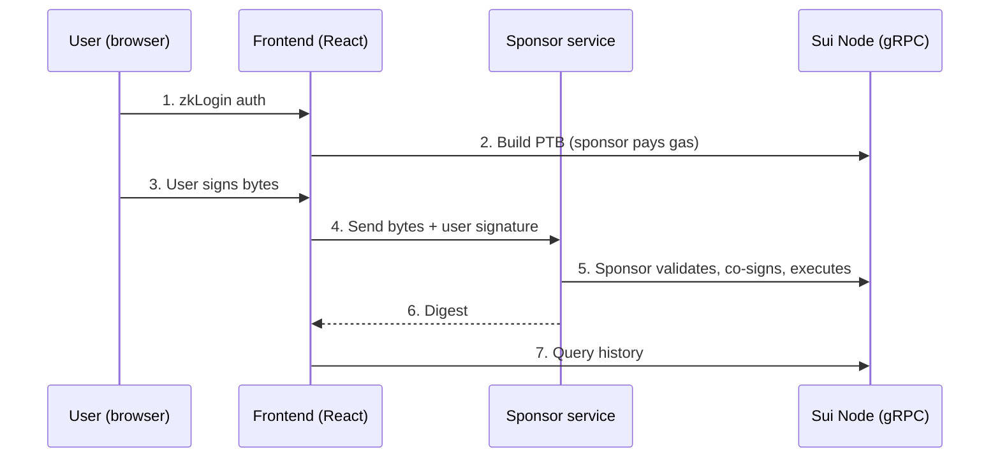

This walkthrough builds a peer-to-peer payments flow that lets users send stablecoins to each other without holding SUI or managing private keys. It stitches together four primitives:

1. **Authentication:** zkLogin or wallet connection
2. **Gas sponsorship:** a sponsor service pays the fee
3. **Transfer:** address balance `send_funds` for the actual payment
4. **Transaction history:** gRPC query for past payments

Each section is self-contained. You can adopt individual pieces or wire the full flow.

## Architecture



## Prerequisites

<Tabs className="tabsHeadingCentered--small">
<TabItem value="prereq" label="Prerequisites">

- [x] Node.js 18 or later installed.
- [x] `@mysten/sui` SDK installed (`npm install @mysten/sui`).
- [x] The sponsor SDK installed if you self-host sponsorship (`npm install @mysten-incubation/sponsor`).
- [x] Testnet SUI for the sponsor: [get coins from the faucet](/getting-started/onboarding/get-coins), then deposit them into the sponsor's address balance (the faucet only hands out coin objects) — for example with a one-time `0x2::coin::send_funds(coin, sponsorAddress)` call.
- [x] An OAuth client ID (Google) for [zkLogin](/sui-stack/zklogin-integration/zklogin), or an existing wallet for connection.

</TabItem>
</Tabs>

## Step 1: Authentication

Users authenticate with [zkLogin](/sui-stack/zklogin-integration/zklogin) for a wallet-free experience, or connect an existing wallet with [dApp Kit](/getting-started/onboarding/app-frontends).

With zkLogin, the user signs in with their Google (or other OAuth provider) account. The app derives a Sui address from the OAuth JWT. No seed phrase or wallet extension is required. The full zkLogin flow (OAuth redirect, ephemeral key pair, salt, and proof generation) is beyond the scope of this walkthrough:

- For a managed integration, use [Enoki](https://docs.enoki.mystenlabs.com/), which handles the salt service and proving for you.
- To roll your own, follow the [zkLogin integration guide](/sui-stack/zklogin-integration/integration-guide).
- To let users connect an existing wallet instead, use [dApp Kit](/getting-started/onboarding/app-frontends).

Whichever route you take, the outcome of this step is a `Signer` for the user and their Sui address. The rest of this page only depends on that `Signer` interface, so the remaining steps are identical for zkLogin, browser wallets, or any other signer.

## Step 2: Read the sender's balance

Before building the transfer, check the sender's available balance.

```typescript
import { SuiGrpcClient } from '@mysten/sui/grpc';

const client = new SuiGrpcClient({
	baseUrl: 'https://fullnode.testnet.sui.io:443',
	network: 'testnet',
});

const USDC = '0xdba34672e30cb065b1f93e3ab55318768fd6fef66c15942c9f7cb846e2f900e7::usdc::USDC';

const { balance } = await client.getBalance({
	owner: senderAddress,
	coinType: USDC,
});

console.log(`Available USDC: ${balance.balance}`);
```

## Step 3: Build the transfer PTB

Build a programmable transaction block that sends USDC from the sender's address balance to the recipient. Using `send_funds` makes the transfer eligible for [gasless stablecoin transfers](/develop/transaction-payment/gasless-stablecoin-transfers).

```typescript
import { Transaction } from '@mysten/sui/transactions';

const amount = 5_000_000n; // 5 USDC (6 decimals)

const tx = new Transaction();
tx.setSender(senderAddress);

tx.moveCall({
	target: '0x2::balance::send_funds',
	typeArguments: [USDC],
	arguments: [tx.balance({ type: USDC, balance: amount }), tx.pure.address(recipientAddress)],
});
```

:::tip Gasless stablecoin transfers

If the transfer uses an [eligible stablecoin](/develop/transaction-payment/gasless-stablecoin-transfers#eligible-stablecoins), it can execute with no gas payment at all, so you don't need sponsorship. See [Gasless Stablecoin Transfers](/develop/transaction-payment/gasless-stablecoin-transfers) for how to build and submit an eligible transfer.

:::

## Step 4: Sponsor the transaction (if needed)

If the transfer is not eligible for gasless execution (non-stablecoin, or includes other operations), have a sponsor pay the gas. The simplest option is [Enoki sponsored transactions](https://docs.enoki.mystenlabs.com/), a managed service. To run your own sponsor, use the [`@mysten-incubation/sponsor`](https://sdk.mystenlabs.com/sponsor) SDK: the sponsor pays gas from its SUI address balance (no gas coin pool to manage) and validates every transaction against a pluggable policy before co-signing.

On your server, create the sponsor once:

```typescript
import { createSponsor, defaults, gasBudget } from '@mysten-incubation/sponsor';

// Passing `validate` replaces the default policy rather than extending
// it, so keep defaults() in the array alongside your own validators.
// (With no `validate` at all, the sponsor runs defaults() on its own.)
const sponsor = createSponsor({
	signer: sponsorSigner,
	client,
	validate: [defaults(), gasBudget({ max: 50_000_000n })],
});
```

In the app, build the transaction with the sponsor as gas owner and have the user sign the final bytes. The `sponsor` object only exists on your server, so the app needs the sponsor's address some other way: ship it in app config, or expose an endpoint that returns `sponsor.address`. Then send the bytes and user signature to your server, where the sponsor validates, co-signs, and executes:

```typescript
// Client side: the sponsor pays from its address balance (no specific
// gas coins). sponsorAddress comes from app config or an endpoint that
// returns the server's sponsor.address.
tx.setSender(senderAddress);
tx.setGasOwner(sponsorAddress);
tx.setGasPayment([]);
const bytes = await tx.build({ client });

// The user signs the final bytes.
const { signature: userSignature } = await signer.signTransaction(bytes);

// Server side: the sponsor validates, co-signs, and executes.
const result = await sponsor.signAndExecuteTransaction({
	transaction: bytes,
	userSignature,
});

// Three outcomes, not two:
switch (result.$kind) {
	case 'Rejected':
		// A validator declined; nothing was signed or executed.
		throw new Error(result.issues.map((issue) => issue.message).join('; '));
	case 'FailedTransaction':
		// Executed on-chain but aborted; the sponsor still paid gas.
		throw new Error(`Payment failed: ${result.FailedTransaction.status.error?.message}`);
	case 'Transaction':
		console.log('Payment confirmed:', result.Transaction.digest);
}
```

For gasless-eligible transfers, skip sponsorship and submit directly:

```typescript
const result = await client.signAndExecuteTransaction({
	transaction: tx,
	signer,
});
```

## Step 5: Confirm the transaction

After a direct submission, wait for finality and verify the outcome before showing success to the user. (The sponsored flow above already handles its outcomes.)

```typescript
// Always wait for indexing first, so the transaction is queryable
// whether it succeeded or failed.
await client.waitForTransaction({ result });

if (result.$kind === 'FailedTransaction') {
	console.error('Payment failed:', result.FailedTransaction.status.error?.message);
	// Show error UI
} else {
	console.log('Payment confirmed:', result.Transaction.digest);
	// Show success UI
}
```

## Step 6: Query transaction history

Display payments the user sent by querying transactions from their address, using the same `SuiGrpcClient` as the rest of the app. Note that `listTransactions` filters by sender (or Move function), so this shows outgoing payments only — incoming payments don't appear.

```typescript
const { transactions } = await client.listTransactions({
	filter: { sender: senderAddress },
	order: 'descending',
	limit: 20,
	include: { balanceChanges: true },
});

for (const result of transactions) {
	// Skip transactions that aborted on-chain.
	if (result.$kind !== 'Transaction') continue;
	const txn = result.Transaction;

	// Pair the sender's negative change with the recipient's positive change
	const sent = txn.balanceChanges.find(
		(change) =>
			change.coinType === USDC && change.address === senderAddress && BigInt(change.amount) < 0n,
	);
	const received = txn.balanceChanges.find(
		(change) =>
			change.coinType === USDC && change.address !== senderAddress && BigInt(change.amount) > 0n,
	);

	if (sent && received) {
		console.log(`Sent ${-Number(sent.amount) / 1_000_000} USDC`, `to ${received.address}`);
	}
}
```

To show incoming payments, higher-volume history, or filtered views (by coin type, date range, or amount), build a [custom indexer](/develop/accessing-data/custom-indexer/custom-indexers) that listens for payment events and stores them in a queryable database.

## Putting it together

The full flow in a single function. Accepting a `Signer` (rather than a concrete `Keypair`) lets it work with key pairs, wallet signers, and KMS signers without code changes.

```typescript
import type { Signer } from '@mysten/sui/cryptography';

async function sendPayment(
	client: SuiGrpcClient,
	signer: Signer,
	recipientAddress: string,
	amount: bigint,
	coinType: string,
) {
	// Build the transfer
	const tx = new Transaction();
	tx.setSender(signer.toSuiAddress());
	tx.moveCall({
		target: '0x2::balance::send_funds',
		typeArguments: [coinType],
		arguments: [tx.balance({ type: coinType, balance: amount }), tx.pure.address(recipientAddress)],
	});

	// Submit
	const result = await client.signAndExecuteTransaction({ transaction: tx, signer });

	// Wait for indexing before inspecting or returning the result
	await client.waitForTransaction({ result });

	if (result.$kind === 'FailedTransaction') {
		throw new Error(`Payment failed: ${result.FailedTransaction.status.error?.message}`);
	}

	return result.Transaction;
}
```

## Next steps

- [Choose Your Payments Model](/onchain-finance/choose-payments-model): decide between basic transfers, Payment Kit, or custom Move
- [Sponsored Transactions](/develop/transaction-payment/sponsor-txn): how sponsorship works at the protocol level
- [Sponsor SDK](https://sdk.mystenlabs.com/sponsor): build your own sponsor service with `@mysten-incubation/sponsor`
- [Payment Intents](/onchain-finance/payment-intents): compose multiple operations into a single atomic transaction
- [Gasless Stablecoin Transfers](/develop/transaction-payment/gasless-stablecoin-transfers): eligible stablecoins and how gasless works
- [zkLogin](/sui-stack/zklogin-integration/zklogin): wallet-free authentication for your users
