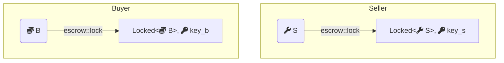
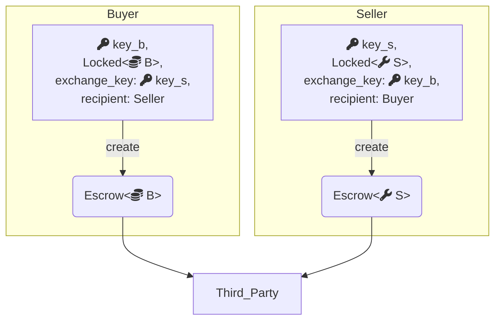
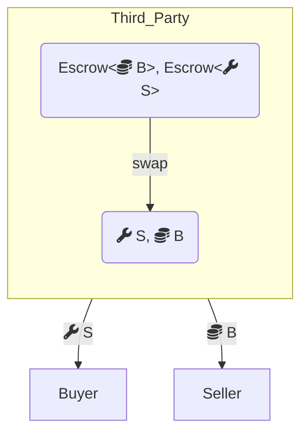
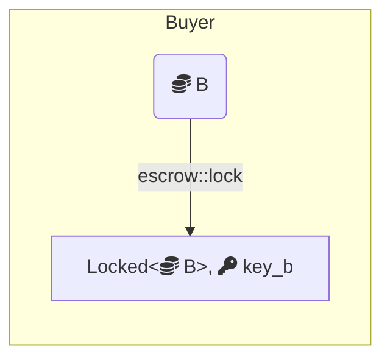
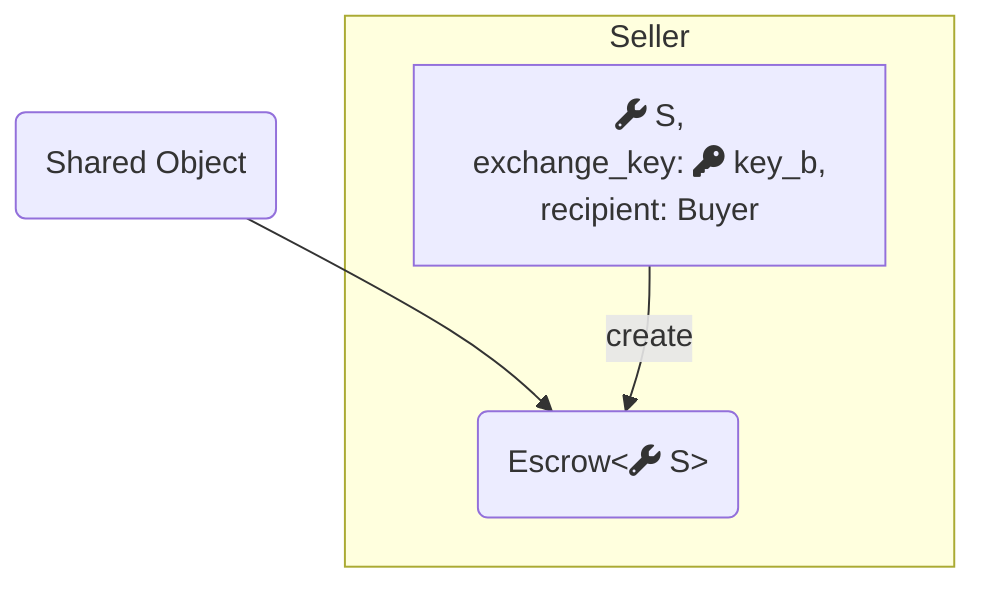
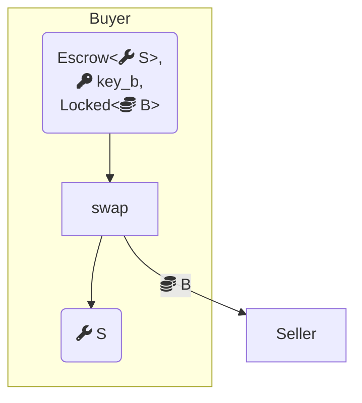

[Move packages](/develop/publish-upgrade-packages) are versioned and stored onchain, but follow a different scheme because they are immutable from inception. Package transaction inputs are referenced by ID alone. They are always loaded at their latest version.

### User packages

Every publish or upgrade generates a new ID. A newly published package starts at version 1; each upgrade increments the version by 1 from the immediately preceding version. Unlike objects, older package versions remain accessible after an upgrade. A package upgraded twice might appear in the store as:

```
(0x17fb7f87e48622257725f584949beac81539a3f4ff864317ad90357c37d82605, 1) => P v1
(0x260f6eeb866c61ab5659f4a89bc0704dd4c51a573c4f4627e40c5bb93d4d500e, 2) => P v2
(0xd24cc3ec3e2877f085bc756337bf73ae6976c38c3d93a0dbaf8004505de980ef, 3) => P v3
```

All three versions are at different IDs and remain callable, including `v1` even after `v3` exists.

### Framework packages

Framework packages, such as the [Move standard library](https://move-book.com/reference/) at `0x1`, the [Sui framework](https://docs.sui.io/references/framework/sui_sui) at `0x2`, the [Sui system library](https://docs.sui.io/references/framework/sui_system) at `0x3`, and [DeepBook](/onchain-finance/deepbookv3/deepbook) at `0xdee9`, are a special case. Their IDs must remain stable across upgrades. The network upgrades them through a system transaction at epoch boundaries, preserving IDs while incrementing versions:

```
(0x1, 1) => MoveStdlib v1
(0x1, 2) => MoveStdlib v2
(0x1, 3) => MoveStdlib v3
```

### Package manifest versions

Package manifest files include version fields in both the `[package]` section and `[dependencies]`. These are for user-level documentation only, as the `publish` and `upgrade` commands do not use them. Two publishes of the same package with different manifest versions are treated as entirely separate packages and cannot be used as dependency overrides for each other.

## Fastpath vs. consensus: comparison

| | Fastpath | Consensus |
| :-- | :-- | :-- |
| **Supported ownership** | Address-owned, immutable | Address-owned, party, shared |
| **Version input** | Must specify exact ID and version | Specify ID and shared-at version; consensus assigns access version |
| **Latency** | Low | Higher |
| **Gas cost** | Lower | Higher |
| **Multi-party access** | Requires offchain coordination | Handled onchain |
| **Equivocation risk** | Yes, if same object used in two transactions | No |
| **Best for** | Latency-sensitive, single-party, or offchain-coordinated apps | Multi-party coordination, frequently shared objects |

## Example: escrow swap

This example demonstrates the trade-offs by implementing the same trustless object swap service two ways, one using fastpath address-owned objects with a custodian, and one using a consensus shared object.

Both implementations use a locking primitive:

```move
module escrow::lock {
    public fun lock<T: store>(obj: T, ctx: &mut TxContext): (Locked<T>, Key);
    public fun unlock<T: store>(locked: Locked<T>, key: Key): T
}
```

Any `T: store` can be locked to get a `Locked<T>` and a corresponding `Key`. Unlocking consumes the key, so any tampering with the locked value is detectable by monitoring the key's ID.

View the [complete code](https://github.com/MystenLabs/sui/blob/93e6b4845a481300ed4a56ab4ac61c5ccb6aa008/examples/move/escrow/sources/lock.move) on GitHub.

### Fastpath: address-owned objects

<details>
<summary>`owned.move`</summary>

```move title="examples/trading/contracts/escrow/sources/owned.move"
/// An escrow for atomic swap of objects using single-owner transactions that
/// trusts a third party for liveness, but not safety.
///
/// Swap via Escrow proceeds in three phases:
///
/// 1. Both parties `lock` their objects, getting the `Locked` object and a
///    `Key`.  Each party can `unlock` their object, to preserve liveness if the
///    other party stalls before completing the second stage.
///
/// 2. Both parties register an `Escrow` object with the custodian, this
///    requires passing the locked object and its key.  The key is consumed to
///    unlock the object, but its ID is remembered so the custodian can ensure
///    the right objects being swapped.  The custodian is trusted to preserve
///    liveness.
///
/// 3. The custodian swaps the locked objects as long as all conditions are met:
///
///    - The sender of one Escrow is the recipient of the other and vice versa.
///      If this is not true, the custodian has incorrectly paired together this
///      swap.
///
///    - The key of the desired object (`exchange_key`) matches the key the
///      other object was locked with (`escrowed_key`) and vice versa.

///      If this is not true, it means the wrong objects are being swapped,
///      either because the custodian paired the wrong escrows together, or
///      because one of the parties tampered with their object after locking it.
///
///      The key in question is the ID of the `Key` object that unlocked the
///      `Locked` object that the respective objects resided in immediately
///      before being sent to the custodian.
module escrow::owned;

use escrow::lock::{Locked, Key};

/// An object held in escrow
public struct Escrow<T: key + store> has key {
    id: UID,
    /// Owner of `escrowed`
    sender: address,
    /// Intended recipient
    recipient: address,
    /// The ID of the key that opens the lock on the object sender wants
    /// from recipient.
    exchange_key: ID,
    /// The ID of the key that locked the escrowed object, before it was
    /// escrowed.
    escrowed_key: ID,
    /// The escrowed object.
    escrowed: T,
}

// === Error codes ===

/// The `sender` and `recipient` of the two escrowed objects do not match
const EMismatchedSenderRecipient: u64 = 0;

/// The `exchange_key` fields of the two escrowed objects do not match
const EMismatchedExchangeObject: u64 = 1;

// === Public Functions ===

/// `ctx.sender()` requests a swap with `recipient` of a locked
/// object `locked` in exchange for an object referred to by `exchange_key`.
/// The swap is performed by a third-party, `custodian`, that is trusted to
/// maintain liveness, but not safety (the only actions they can perform are
/// to successfully progress the swap).
///
/// `locked` will be unlocked with its corresponding `key` before being sent
/// to the custodian, but the underlying object is still not accessible
/// until after the swap has executed successfully, or the custodian returns
/// the object.
///
/// `exchange_key` is the ID of a `Key` that unlocks the sender's desired
/// object.  Gating the swap on the key ensures that it will not succeed if
/// the desired object is tampered with after the sender's object is held in
/// escrow, because the recipient would have to consume the key to tamper
/// with the object, and if they re-locked the object it would be protected
/// by a different, incompatible key.
public fun create<T: key + store>(
    key: Key,
    locked: Locked<T>,
    exchange_key: ID,
    recipient: address,
    custodian: address,
    ctx: &mut TxContext,
) {
    let escrow = Escrow {
        id: object::new(ctx),
        sender: ctx.sender(),
        recipient,
        exchange_key,
        escrowed_key: object::id(&key),
        escrowed: locked.unlock(key),
    };

    transfer::transfer(escrow, custodian);
}

/// Function for custodian (trusted third-party) to perform a swap between
/// two parties.  Fails if their senders and recipients do not match, or if
/// their respective desired objects do not match.
public fun swap<T: key + store, U: key + store>(obj1: Escrow<T>, obj2: Escrow<U>) {
    let Escrow {
        id: id1,
        sender: sender1,
        recipient: recipient1,
        exchange_key: exchange_key1,
        escrowed_key: escrowed_key1,
        escrowed: escrowed1,
    } = obj1;

    let Escrow {
        id: id2,
        sender: sender2,
        recipient: recipient2,
        exchange_key: exchange_key2,
        escrowed_key: escrowed_key2,
        escrowed: escrowed2,
    } = obj2;
    id1.delete();
    id2.delete();

    // Make sure the sender and recipient match each other
    assert!(sender1 == recipient2, EMismatchedSenderRecipient);
    assert!(sender2 == recipient1, EMismatchedSenderRecipient);

    // Make sure the objects match each other and haven't been modified
    // (they remain locked).
    assert!(escrowed_key1 == exchange_key2, EMismatchedExchangeObject);
    assert!(escrowed_key2 == exchange_key1, EMismatchedExchangeObject);

    // Do the actual swap
    transfer::public_transfer(escrowed1, recipient1);
    transfer::public_transfer(escrowed2, recipient2);
}

/// The custodian can always return an escrowed object to its original
/// owner.
public fun return_to_sender<T: key + store>(obj: Escrow<T>) {
    let Escrow {
        id,
        sender,
        recipient: _,
        exchange_key: _,
        escrowed_key: _,
        escrowed,
    } = obj;
    id.delete();
    transfer::public_transfer(escrowed, sender);
}

// === Tests ===
#[test_only]
use sui::coin::{Self, Coin};
#[test_only]
use sui::sui::SUI;
#[test_only]
use sui::test_scenario::{Self as ts, Scenario};

#[test_only]
use escrow::lock;

#[test_only]
const ALICE: address = @0xA;
#[test_only]
const BOB: address = @0xB;
#[test_only]
const CUSTODIAN: address = @0xC;
#[test_only]
const DIANE: address = @0xD;

#[test_only]
fun test_coin(ts: &mut Scenario): Coin<SUI> {
    coin::mint_for_testing<SUI>(42, ts::ctx(ts))
}

#[test]
fun test_successful_swap() {
    let mut ts = ts::begin(@0x0);

    // Alice locks the object they want to trade
    let (i1, ik1) = {
        ts.next_tx(ALICE);
        let c = test_coin(&mut ts);
        let cid = object::id(&c);
        let (l, k) = lock::lock(c, ts.ctx());
        let kid = object::id(&k);
        transfer::public_transfer(l, ALICE);
        transfer::public_transfer(k, ALICE);
        (cid, kid)
    };

    // Bob locks their object as well.
    let (i2, ik2) = {
        ts.next_tx(BOB);
        let c = test_coin(&mut ts);
        let cid = object::id(&c);
        let (l, k) = lock::lock(c, ts.ctx());
        let kid = object::id(&k);
        transfer::public_transfer(l, BOB);
        transfer::public_transfer(k, BOB);
        (cid, kid)
    };

    // Alice gives the custodian their object to hold in escrow.
    {
        ts.next_tx(ALICE);
        let k1: Key = ts.take_from_sender();
        let l1: Locked<Coin<SUI>> = ts.take_from_sender();
        create(k1, l1, ik2, BOB, CUSTODIAN, ts.ctx());
    };

    // Bob does the same.
    {
        ts.next_tx(BOB);
        let k2: Key = ts.take_from_sender();
        let l2: Locked<Coin<SUI>> = ts.take_from_sender();
        create(k2, l2, ik1, ALICE, CUSTODIAN, ts.ctx());
    };

    // The custodian makes the swap
    {
        ts.next_tx(CUSTODIAN);
        swap<Coin<SUI>, Coin<SUI>>(
            ts.take_from_sender(),
            ts.take_from_sender(),
        );
    };

    // Commit effects from the swap
    ts.next_tx(@0x0);

    // Alice gets the object from Bob
    {
        let c: Coin<SUI> = ts.take_from_address_by_id(ALICE, i2);
        ts::return_to_address(ALICE, c);
    };

    // Bob gets the object from Alice
    {
        let c: Coin<SUI> = ts.take_from_address_by_id(BOB, i1);
        ts::return_to_address(BOB, c);
    };

    ts.end();
}

#[test]
#[expected_failure(abort_code = EMismatchedSenderRecipient)]
fun test_mismatch_sender() {
    let mut ts = ts::begin(@0x0);

    let ik1 = {
        ts.next_tx(ALICE);
        let c = test_coin(&mut ts);
        let (l, k) = lock::lock(c, ts.ctx());
        let kid = object::id(&k);
        transfer::public_transfer(l, ALICE);
        transfer::public_transfer(k, ALICE);
        kid
    };

    let ik2 = {
        ts.next_tx(BOB);
        let c = test_coin(&mut ts);
        let (l, k) = lock::lock(c, ts.ctx());
        let kid = object::id(&k);
        transfer::public_transfer(l, BOB);
        transfer::public_transfer(k, BOB);
        kid
    };

    // Alice wants to trade with Bob.
    {
        ts.next_tx(ALICE);
        let k1: Key = ts.take_from_sender();
        let l1: Locked<Coin<SUI>> = ts.take_from_sender();
        create(k1, l1, ik2, BOB, CUSTODIAN, ts.ctx());
    };

    // But Bob wants to trade with Diane.
    {
        ts.next_tx(BOB);
        let k2: Key = ts.take_from_sender();
        let l2: Locked<Coin<SUI>> = ts.take_from_sender();
        create(k2, l2, ik1, DIANE, CUSTODIAN, ts.ctx());
    };

    // When the custodian tries to match up the swap, it will fail.
    {
        ts.next_tx(CUSTODIAN);
        swap<Coin<SUI>, Coin<SUI>>(
            ts.take_from_sender(),
            ts.take_from_sender(),
        );
    };

    abort 1337
}

#[test]
#[expected_failure(abort_code = EMismatchedExchangeObject)]
fun test_mismatch_object() {
    let mut ts = ts::begin(@0x0);

    let ik1 = {
        ts.next_tx(ALICE);
        let c = test_coin(&mut ts);
        let (l, k) = lock::lock(c, ts.ctx());
        let kid = object::id(&k);
        transfer::public_transfer(l, ALICE);
        transfer::public_transfer(k, ALICE);
        kid
    };

    {
        ts.next_tx(BOB);
        let c = test_coin(&mut ts);
        let (l, k) = lock::lock(c, ts.ctx());
        transfer::public_transfer(l, BOB);
        transfer::public_transfer(k, BOB);
    };

    // Alice wants to trade with Bob, but Alice has asked for an
    // object (via its `exchange_key`) that Bob has not put up for
    // the swap.
    {
        ts.next_tx(ALICE);
        let k1: Key = ts.take_from_sender();
        let l1: Locked<Coin<SUI>> = ts.take_from_sender();
        create(k1, l1, ik1, BOB, CUSTODIAN, ts.ctx());
    };

    {
        ts.next_tx(BOB);
        let k2: Key = ts.take_from_sender();
        let l2: Locked<Coin<SUI>> = ts.take_from_sender();
        create(k2, l2, ik1, ALICE, CUSTODIAN, ts.ctx());
    };

    // When the custodian tries to match up the swap, it will fail.
    {
        ts.next_tx(CUSTODIAN);
        swap<Coin<SUI>, Coin<SUI>>(
            ts.take_from_sender(),
            ts.take_from_sender(),
        );
    };

    abort 1337
}

#[test]
#[expected_failure(abort_code = EMismatchedExchangeObject)]
fun test_object_tamper() {
    let mut ts = ts::begin(@0x0);

    // Alice locks the object they want to trade
    let ik1 = {
        ts.next_tx(ALICE);
        let c = test_coin(&mut ts);
        let (l, k) = lock::lock(c, ts.ctx());
        let kid = object::id(&k);
        transfer::public_transfer(l, ALICE);
        transfer::public_transfer(k, ALICE);
        kid
    };

    // Bob locks their object as well.
    let ik2 = {
        ts.next_tx(BOB);
        let c = test_coin(&mut ts);
        let (l, k) = lock::lock(c, ts.ctx());
        let kid = object::id(&k);
        transfer::public_transfer(l, BOB);
        transfer::public_transfer(k, BOB);
        kid
    };

    // Alice gives the custodian their object to hold in escrow.
    {
        ts.next_tx(ALICE);
        let k1: Key = ts.take_from_sender();
        let l1: Locked<Coin<SUI>> = ts.take_from_sender();
        create(k1, l1, ik2, BOB, CUSTODIAN, ts.ctx());
    };

    // Bob has a change of heart, so they unlock the object and tamper
    // with it.
    {
        ts.next_tx(BOB);
        let k: Key = ts.take_from_sender();
        let l: Locked<Coin<SUI>> = ts.take_from_sender();
        let mut c = lock::unlock(l, k);

        let _dust = coin::split(&mut c, 1, ts.ctx());
        let (l, k) = lock::lock(c, ts.ctx());
        create(k, l, ik1, ALICE, CUSTODIAN, ts.ctx());
    };

    // When the Custodian makes the swap, it detects Bob's nefarious
    // behaviour.
    {
        ts.next_tx(CUSTODIAN);
        swap<Coin<SUI>, Coin<SUI>>(
            ts.take_from_sender(),
            ts.take_from_sender(),
        );
    };

    abort 1337
}

#[test]
fun test_return_to_sender() {
    let mut ts = ts::begin(@0x0);

    // Alice locks the object they want to trade
    let cid = {
        ts.next_tx(ALICE);
        let c = test_coin(&mut ts);
        let cid = object::id(&c);
        let (l, k) = lock::lock(c, ts.ctx());
        let i = object::id_from_address(@0x0);
        create(k, l, i, BOB, CUSTODIAN, ts.ctx());
        cid
    };

    // Custodian sends it back
    {
        ts.next_tx(CUSTODIAN);
        return_to_sender<Coin<SUI>>(ts.take_from_sender());
    };

    ts.next_tx(@0x0);

    // Alice can then access it.
    {
        let c: Coin<SUI> = ts.take_from_address_by_id(ALICE, cid);
        ts::return_to_address(ALICE, c)
    };

    ts.end();
}
```

</details>

Both parties begin by locking their objects. If either decides not to proceed, they unlock and exit.



Both parties then swap keys:


A third-party custodian holds the objects and matches them when both arrive. The `create` function sends the `Escrow` request to the custodian, unlocking the offered object while recording the ID of the key it was locked with:

```move title="examples/trading/contracts/escrow/sources/owned.move"
public fun create<T: key + store>(
    key: Key,
    locked: Locked<T>,
    exchange_key: ID,
    recipient: address,
    custodian: address,
    ctx: &mut TxContext,
) {
    let escrow = Escrow {
        id: object::new(ctx),
        sender: ctx.sender(),
        recipient,
        exchange_key,
        escrowed_key: object::id(&key),
        escrowed: locked.unlock(key),
    };

    transfer::transfer(escrow, custodian);
}
```



Even though the custodian owns both objects, the only valid actions in Move are to match them correctly or return them. The `swap` function verifies that senders and recipients match and that each party wants what the other is offering by comparing key IDs:

```move title="examples/trading/contracts/escrow/sources/owned.move"
/// Function for custodian (trusted third-party) to perform a swap between
/// two parties.  Fails if their senders and recipients do not match, or if
/// their respective desired objects do not match.
public fun swap<T: key + store, U: key + store>(obj1: Escrow<T>, obj2: Escrow<U>) {
    let Escrow {
        id: id1,
        sender: sender1,
        recipient: recipient1,
        exchange_key: exchange_key1,
        escrowed_key: escrowed_key1,
        escrowed: escrowed1,
    } = obj1;

    let Escrow {
        id: id2,
        sender: sender2,
        recipient: recipient2,
        exchange_key: exchange_key2,
        escrowed_key: escrowed_key2,
        escrowed: escrowed2,
    } = obj2;
    id1.delete();
    id2.delete();

    // Make sure the sender and recipient match each other
    assert!(sender1 == recipient2, EMismatchedSenderRecipient);
    assert!(sender2 == recipient1, EMismatchedSenderRecipient);

    // Make sure the objects match each other and haven't been modified
    // (they remain locked).
    assert!(escrowed_key1 == exchange_key2, EMismatchedExchangeObject);
    assert!(escrowed_key2 == exchange_key1, EMismatchedExchangeObject);

    // Do the actual swap
    transfer::public_transfer(escrowed1, recipient1);
    transfer::public_transfer(escrowed2, recipient2);
}
```



### Consensus: shared object

<details>
<summary>`shared.move`</summary>

```move title="examples/trading/contracts/escrow/sources/shared.move"
/// An escrow for atomic swap of objects using shared objects without a trusted
/// third party.
///
/// The protocol consists of three phases:
///
/// 1. One party `lock`s their object, getting a `Locked` object and its `Key`.
///    This party can `unlock` their object to preserve livness if the other
///    party stalls before completing the second stage.
///
/// 2. The other party registers a publicly accessible, shared `Escrow` object.
///    This effectively locks their object at a particular version as well,
///    waiting for the first party to complete the swap.  The second party is
///    able to request their object is returned to them, to preserve liveness as
///    well.
///
/// 3. The first party sends their locked object and its key to the shared
///    `Escrow` object.  This completes the swap, as long as all conditions are
///    met:
///
///    - The sender of the swap transaction is the recipient of the `Escrow`.
///
///    - The key of the desired object (`exchange_key`) in the escrow matches
///      the key supplied in the swap.
///
///    - The key supplied in the swap unlocks the `Locked<U>`.
module escrow::shared;

use escrow::lock::{Locked, Key};
use sui::dynamic_object_field as dof;
use sui::event;

/// The `name` of the DOF that holds the Escrowed object.
/// Allows easy discoverability for the escrowed object.
public struct EscrowedObjectKey has copy, drop, store {}

/// An object held in escrow
///
/// The escrowed object is added as a Dynamic Object Field so it can still be looked-up.
public struct Escrow<phantom T: key + store> has key, store {
    id: UID,
    /// Owner of `escrowed`
    sender: address,
    /// Intended recipient
    recipient: address,
    /// ID of the key that opens the lock on the object sender wants from
    /// recipient.
    exchange_key: ID,
}

// === Error codes ===

/// The `sender` and `recipient` of the two escrowed objects do not match
const EMismatchedSenderRecipient: u64 = 0;

/// The `exchange_for` fields of the two escrowed objects do not match
const EMismatchedExchangeObject: u64 = 1;

// === Public Functions ===
public fun create<T: key + store>(
    escrowed: T,
    exchange_key: ID,
    recipient: address,
    ctx: &mut TxContext,
) {
    let mut escrow = Escrow<T> {
        id: object::new(ctx),
        sender: ctx.sender(),
        recipient,
        exchange_key,
    };
    event::emit(EscrowCreated {
        escrow_id: object::id(&escrow),
        key_id: exchange_key,
        sender: escrow.sender,
        recipient,
        item_id: object::id(&escrowed),
    });

    dof::add(&mut escrow.id, EscrowedObjectKey {}, escrowed);

    transfer::public_share_object(escrow);
}

/// The `recipient` of the escrow can exchange `obj` with the escrowed item
public fun swap<T: key + store, U: key + store>(
    mut escrow: Escrow<T>,
    key: Key,
    locked: Locked<U>,
    ctx: &TxContext,
): T {
    let escrowed = dof::remove<EscrowedObjectKey, T>(&mut escrow.id, EscrowedObjectKey {});

    let Escrow {
        id,
        sender,
        recipient,
        exchange_key,
    } = escrow;

    assert!(recipient == ctx.sender(), EMismatchedSenderRecipient);
    assert!(exchange_key == object::id(&key), EMismatchedExchangeObject);

    // Do the actual swap
    transfer::public_transfer(locked.unlock(key), sender);

    event::emit(EscrowSwapped {
        escrow_id: id.to_inner(),
    });

    id.delete();

    escrowed
}

/// The `creator` can cancel the escrow and get back the escrowed item
public fun return_to_sender<T: key + store>(mut escrow: Escrow<T>, ctx: &TxContext): T {
    event::emit(EscrowCancelled {
        escrow_id: object::id(&escrow),
    });

    let escrowed = dof::remove<EscrowedObjectKey, T>(&mut escrow.id, EscrowedObjectKey {});

    let Escrow {
        id,
        sender,
        recipient: _,
        exchange_key: _,
    } = escrow;

    assert!(sender == ctx.sender(), EMismatchedSenderRecipient);
    id.delete();
    escrowed
}

// === Events ===
public struct EscrowCreated has copy, drop {
    /// the ID of the escrow that was created
    escrow_id: ID,
    /// The ID of the `Key` that unlocks the requested object.
    key_id: ID,
    /// The id of the sender who'll receive `T` upon swap
    sender: address,
    /// The (original) recipient of the escrowed object
    recipient: address,
    /// The ID of the escrowed item
    item_id: ID,
}

public struct EscrowSwapped has copy, drop {
    escrow_id: ID,
}

public struct EscrowCancelled has copy, drop {
    escrow_id: ID,
}

// === Tests ===
#[test_only]
use sui::coin::{Self, Coin};
#[test_only]
use sui::sui::SUI;
#[test_only]
use sui::test_scenario::{Self as ts, Scenario};

#[test_only]
use escrow::lock;

#[test_only]
const ALICE: address = @0xA;
#[test_only]
const BOB: address = @0xB;
#[test_only]
const DIANE: address = @0xD;

#[test_only]
fun test_coin(ts: &mut Scenario): Coin<SUI> {
    coin::mint_for_testing<SUI>(42, ts.ctx())
}
#[test]
fun test_successful_swap() {
    let mut ts = ts::begin(@0x0);

    // Bob locks the object they want to trade.
    let (i2, ik2) = {
        ts.next_tx(BOB);
        let c = test_coin(&mut ts);
        let cid = object::id(&c);
        let (l, k) = lock::lock(c, ts.ctx());
        let kid = object::id(&k);
        transfer::public_transfer(l, BOB);
        transfer::public_transfer(k, BOB);
        (cid, kid)
    };

    // Alice creates a public Escrow holding the object they are willing to
    // share, and the object they want from Bob
    let i1 = {
        ts.next_tx(ALICE);
        let c = test_coin(&mut ts);
        let cid = object::id(&c);
        create(c, ik2, BOB, ts.ctx());
        cid
    };

    // Bob responds by offering their object, and gets Alice's object in
    // return.
    {
        ts.next_tx(BOB);
        let escrow: Escrow<Coin<SUI>> = ts.take_shared();
        let k2: Key = ts.take_from_sender();
        let l2: Locked<Coin<SUI>> = ts.take_from_sender();
        let c = escrow.swap(k2, l2, ts.ctx());

        transfer::public_transfer(c, BOB);
    };
    // Commit effects from the swap
    ts.next_tx(@0x0);

    // Alice gets the object from Bob
    {
        let c: Coin<SUI> = ts.take_from_address_by_id(ALICE, i2);
        ts::return_to_address(ALICE, c);
    };

    // Bob gets the object from Alice
    {
        let c: Coin<SUI> = ts.take_from_address_by_id(BOB, i1);
        ts::return_to_address(BOB, c);
    };

    ts::end(ts);
}

#[test]
#[expected_failure(abort_code = EMismatchedSenderRecipient)]
fun test_mismatch_sender() {
    let mut ts = ts::begin(@0x0);

    let ik2 = {
        ts.next_tx(DIANE);
        let c = test_coin(&mut ts);
        let (l, k) = lock::lock(c, ts.ctx());
        let kid = object::id(&k);
        transfer::public_transfer(l, DIANE);
        transfer::public_transfer(k, DIANE);
        kid
    };

    // Alice wants to trade with Bob.
    {
        ts.next_tx(ALICE);
        let c = test_coin(&mut ts);
        create(c, ik2, BOB, ts.ctx());
    };

    // But Diane is the one who attempts the swap
    {
        ts.next_tx(DIANE);
        let escrow: Escrow<Coin<SUI>> = ts.take_shared();
        let k2: Key = ts.take_from_sender();
        let l2: Locked<Coin<SUI>> = ts.take_from_sender();
        let c = escrow.swap(k2, l2, ts.ctx());

        transfer::public_transfer(c, DIANE);
    };

    abort 1337
}

#[test]
#[expected_failure(abort_code = EMismatchedExchangeObject)]
fun test_mismatch_object() {
    let mut ts = ts::begin(@0x0);

    {
        ts.next_tx(BOB);
        let c = test_coin(&mut ts);
        let (l, k) = lock::lock(c, ts.ctx());
        transfer::public_transfer(l, BOB);
        transfer::public_transfer(k, BOB);
    };

    // Alice wants to trade with Bob, but Alice has asked for an object (via
    // its `exchange_key`) that Bob has not put up for the swap.
    {
        ts.next_tx(ALICE);
        let c = test_coin(&mut ts);
        let cid = object::id(&c);
        create(c, cid, BOB, ts.ctx());
    };

    // When Bob tries to complete the swap, it will fail, because they
    // cannot meet Alice's requirements.
    {
        ts.next_tx(BOB);
        let escrow: Escrow<Coin<SUI>> = ts.take_shared();
        let k2: Key = ts.take_from_sender();
        let l2: Locked<Coin<SUI>> = ts.take_from_sender();
        let c = escrow.swap(k2, l2, ts.ctx());

        transfer::public_transfer(c, BOB);
    };

    abort 1337
}

#[test]
#[expected_failure(abort_code = EMismatchedExchangeObject)]
fun test_object_tamper() {
    let mut ts = ts::begin(@0x0);

    // Bob locks their object.
    let ik2 = {
        ts.next_tx(BOB);
        let c = test_coin(&mut ts);
        let (l, k) = lock::lock(c, ts.ctx());
        let kid = object::id(&k);
        transfer::public_transfer(l, BOB);
        transfer::public_transfer(k, BOB);
        kid
    };

    // Alice sets up the escrow
    {
        ts.next_tx(ALICE);
        let c = test_coin(&mut ts);
        create(c, ik2, BOB, ts.ctx());
    };

    // Bob has a change of heart, so they unlock the object and tamper with
    // it before initiating the swap, but it won't be possible for Bob to
    // hide their tampering.
    {
        ts.next_tx(BOB);
        let k: Key = ts.take_from_sender();
        let l: Locked<Coin<SUI>> = ts.take_from_sender();
        let mut c = lock::unlock(l, k);

        let _dust = c.split(1, ts.ctx());
        let (l, k) = lock::lock(c, ts.ctx());
        let escrow: Escrow<Coin<SUI>> = ts.take_shared();
        let c = escrow.swap(k, l, ts.ctx());

        transfer::public_transfer(c, BOB);
    };

    abort 1337
}

#[test]
fun test_return_to_sender() {
    let mut ts = ts::begin(@0x0);

    // Alice puts up the object they want to trade
    let cid = {
        ts.next_tx(ALICE);
        let c = test_coin(&mut ts);
        let cid = object::id(&c);
        let i = object::id_from_address(@0x0);
        create(c, i, BOB, ts.ctx());
        cid
    };

    // ...but has a change of heart and takes it back
    {
        ts.next_tx(ALICE);
        let escrow: Escrow<Coin<SUI>> = ts.take_shared();
        let c = escrow.return_to_sender(ts.ctx());

        transfer::public_transfer(c, ALICE);
    };

    ts.next_tx(@0x0);

    // Alice can then access it.
    {
        let c: Coin<SUI> = ts.take_from_address_by_id(ALICE, cid);
        ts::return_to_address(ALICE, c)
    };

    ts::end(ts);
}

#[test]
#[expected_failure]
fun test_return_to_sender_failed_swap() {
    let mut ts = ts::begin(@0x0);

    // Bob locks their object.
    let ik2 = {
        ts.next_tx(BOB);
        let c = test_coin(&mut ts);
        let (l, k) = lock::lock(c, ts.ctx());
        let kid = object::id(&k);
        transfer::public_transfer(l, BOB);
        transfer::public_transfer(k, BOB);
        kid
    };

    // Alice creates a public Escrow holding the object they are willing to
    // share, and the object they want from Bob
    {
        ts.next_tx(ALICE);
        let c = test_coin(&mut ts);
        create(c, ik2, BOB, ts.ctx());
    };

    // ...but then has a change of heart
    {
        ts.next_tx(ALICE);
        let escrow: Escrow<Coin<SUI>> = ts.take_shared();
        let c = escrow.return_to_sender(ts.ctx());
        transfer::public_transfer(c, ALICE);
    };

    // Bob's attempt to complete the swap will now fail.
    {
        ts.next_tx(BOB);
        let escrow: Escrow<Coin<SUI>> = ts.take_shared();
        let k2: Key = ts.take_from_sender();
        let l2: Locked<Coin<SUI>> = ts.take_from_sender();
        let c = escrow.swap(k2, l2, ts.ctx());

        transfer::public_transfer(c, BOB);
    };

    abort 1337
}
```

</details>

The first party locks the object they want to swap:



The second party views the locked object and, if interested, creates a swap request that passes their object directly into a shared `Escrow` object. The request records the sender (who can reclaim if the swap doesn't complete) and the intended recipient:

```move title="examples/trading/contracts/escrow/sources/shared.move"
public fun create<T: key + store>(
    escrowed: T,
    exchange_key: ID,
    recipient: address,
    ctx: &mut TxContext,
) {
    let mut escrow = Escrow<T> {
        id: object::new(ctx),
        sender: ctx.sender(),
        recipient,
        exchange_key,
    };
    event::emit(EscrowCreated {
        escrow_id: object::id(&escrow),
        key_id: exchange_key,
        sender: escrow.sender,
        recipient,
        item_id: object::id(&escrowed),
    });

    dof::add(&mut escrow.id, EscrowedObjectKey {}, escrowed);

    transfer::public_share_object(escrow);
}
```



The intended recipient completes the swap by providing their locked object:

```move title="examples/trading/contracts/escrow/sources/shared.move"
/// The `recipient` of the escrow can exchange `obj` with the escrowed item
public fun swap<T: key + store, U: key + store>(
    mut escrow: Escrow<T>,
    key: Key,
    locked: Locked<U>,
    ctx: &TxContext,
): T {
    let escrowed = dof::remove<EscrowedObjectKey, T>(&mut escrow.id, EscrowedObjectKey {});

    let Escrow {
        id,
        sender,
        recipient,
        exchange_key,
    } = escrow;

    assert!(recipient == ctx.sender(), EMismatchedSenderRecipient);
    assert!(exchange_key == object::id(&key), EMismatchedExchangeObject);

    // Do the actual swap
    transfer::public_transfer(locked.unlock(key), sender);

    event::emit(EscrowSwapped {
        escrow_id: id.to_inner(),
    });

    id.delete();

    escrowed
}
```



Although the `Escrow` object is shared and accessible by anyone, Move ensures only the original sender and intended recipient can interact with it. `swap` verifies the locked object matches what was requested, extracts the escrowed object, deletes the wrapper, and delivers both objects to their new owners.